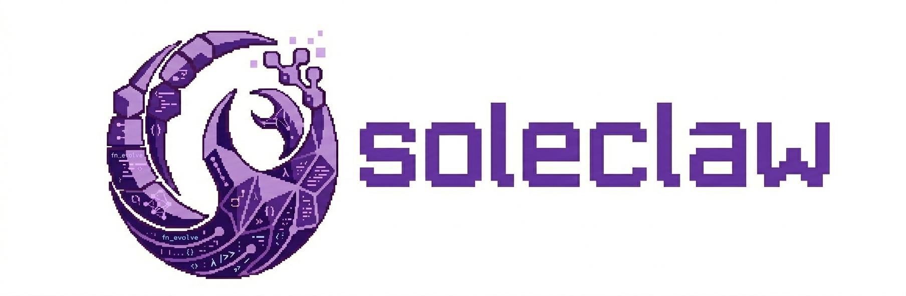

# Soleclaw



A self-evolving personal AI assistant. Instead of shipping fixed tools, soleclaw **forges its own** — the agent identifies what it needs, generates the code, and integrates it into its toolkit permanently.

Inspired by [nanobot](https://github.com/HKUDS/nanobot) and [openclaw](https://github.com/anthropics/openclaw). Built on [claude-agent-sdk](https://github.com/anthropics/claude-agent-sdk).

## Why

Most agent frameworks extend capabilities through markdown skills that teach the agent how to chain built-in tools. Every invocation requires LLM reasoning through the same chain. Skills are knowledge, not capability.

Soleclaw's forge generates **real executable code** registered as first-class tools. The LLM's role shifts from multi-step orchestrator to single-step dispatcher — pick the right tool, pass the right arguments, done. All logic lives in the generated tool's code, not in the LLM's reasoning chain.

The tool library is model-agnostic. Swap Claude for another model and every tool, every piece of data continues to work.

## Architecture

```
User (Telegram / CLI)
  → Channel Layer
    → SoleclawBridge
      ├── ContextBuilder → system prompt (identity, memory, skills, tools)
      ├── @tool functions → in-process MCP server
      └── ClaudeSDKClient → LLM calls + tool execution loop
    → Bus (OutboundMessage)
  → Channel → User
```

```
soleclaw/
├── core/           Bridge, context builder, bootstrap
├── tools/          MCP tool definitions + user tool library
├── forge/          Tool generation engine
├── memory/         Local backend + OpenViking (optional)
├── cron/           Scheduled tasks (cron/every/at)
├── skills/         SKILL.md loader
├── channels/       Telegram, CLI
├── bus/            Async message routing
├── config/         Pydantic config schema
└── cli/            CLI commands (typer)
```

~2900 lines of core code, 39 source files.

## Setup

Requires Python 3.11+.

```bash
pip install soleclaw

# Configure (interactive wizard)
soleclaw configure
```

**From source** (requires [uv](https://docs.astral.sh/uv/)):

```bash
git clone <repo-url> && cd soleclaw
uv sync --all-extras
```

## Usage

```bash
# Run as gateway with telegram, configure can also run gateway automatically
soleclaw gateway start

# Interactive CLI chat
soleclaw agent
soleclaw agent "hello"
```

See [docs/Commands.md](docs/Commands.md) for the full command reference.

## Forge — Tool Generation

When the agent identifies a missing capability, it invokes the forge:

1. Agent proposes a tool to the user
2. User confirms
3. `forge_tool` spawns a ClaudeSDKClient sub-session to generate code
4. Generated tool lands in `~/.soleclaw/tool-library/<name>/`
5. Tool is immediately available via `run_user_tool`

Tool library structure:
```
tool-library/
  └── <tool-name>/
      ├── manifest.json    # name, description, parameters
      └── tool.py          # async def execute(args: dict) -> dict
```

All tool data is stored in a shared SQLite database (`~/.soleclaw/data/store.db`), so tools can cross-reference each other's data.

## Roadmap

- **OpenViking memory** — Replace keyword-based memory search with [OpenViking](https://github.com/anthropics/OpenViking) vector search. The backend code exists (`memory/viking.py`) but requires an `~/.openviking/ov.conf` with embedding and VLM API keys. Once configured, `memory_search` upgrades from substring matching to semantic retrieval with auto-extraction from conversations.
- **Memory consolidation** — Periodic cron job to review daily logs and curate `MEMORY.md` (long-term facts the agent always sees in context).
- **Multi-channel** — Discord, Slack, WeChat channels.
- **Tool sharing** — Export/import tools between soleclaw instances.
